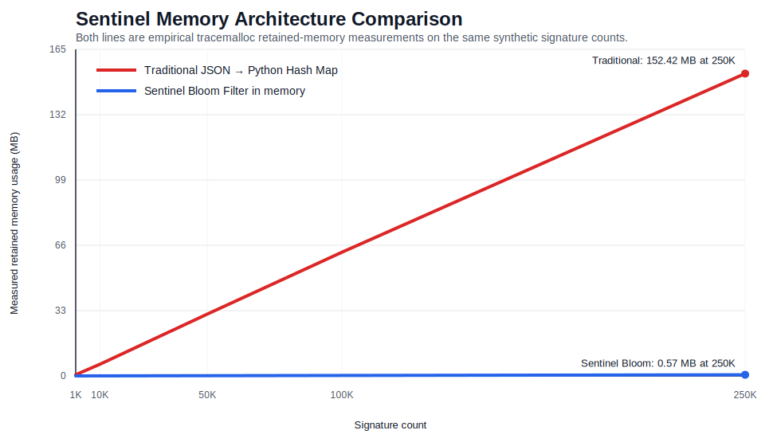
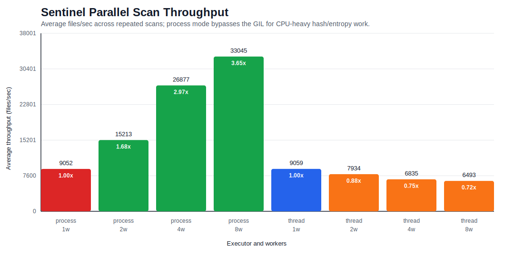

# Sentinel 病毒掃描器專題報告

### Github repo: 
https://github.com/roundspring2003/Sentinel
### 組員
黃沅椿
## 1. 專案摘要

本專案實作一套 Python 命令列病毒掃描器 **Sentinel**。系統核心目標是建立一個具備防禦性設計的特徵碼式病毒掃描器，能遞迴掃描指定資料夾，透過已知惡意特徵碼、雜湊值比對、十六進位內容樣式比對，以及啟發式分析偵測可疑檔案，同時避免因大量特徵碼或極端檔案狀況拖垮系統。

Sentinel 的主要設計重點如下：

- 使用 **Bloom Filter（布隆過濾器）+ SQLite** 的混合式特徵碼資料庫，降低啟動時的記憶體負擔。
- 使用 **分塊讀取** 計算 MD5、SHA-256、資訊熵與內容樣式比對，避免一次載入大型檔案。
- 支援 **ThreadPoolExecutor** 與 **ProcessPoolExecutor**，並以實驗驗證多進程對 CPU 密集型掃描流程的效能提升。
- 實作 **PE IAT 啟發式分析**、**Shannon entropy 資訊熵分析** 與安全可重現的 mock IAT demo。
- 針對空檔案、權限不足檔案、symbolic link 迴圈等極端狀況做防禦性處理。
- 產生 JSON 與文字掃描報告，並支援效能測試模式。

## 2. 系統架構

Sentinel 的整體流程如下：

```text
data/signatures.json
        |
        v
build_db.py
        |
        +--> data/signatures.db   SQLite 特徵碼資料庫
        |
        +--> data/filter.bloom    序列化後的 Bloom Filter

掃描目標資料夾
        |
        v
分塊檔案掃描
        |
        +--> MD5 / SHA-256
        +--> 十六進位內容樣式串流比對
        +--> 資訊熵計算
        +--> PE / mock IAT 啟發式分析
        |
        v
JSON / 文字報告 + 效能測試指標
```

執行掃描時，命令列介面會載入 `data/filter.bloom` 與 `data/signatures.db`：

```bash
python3 -m sentinel scan samples/report_demo \
  --db data/signatures.db \
  --bloom data/filter.bloom \
  --report reports/report_demo_scan.json \
  --text-report reports/report_demo_scan.txt \
  --benchmark \
  --workers 8 \
  --executor process
```

## 3. 混合式特徵碼資料庫

### 3.1 特徵碼來源

原始特徵碼資料存放於 `data/signatures.json`。每筆特徵碼包含：

| 欄位 | 用途 |
| --- | --- |
| `id` | 特徵碼 ID |
| `name` | 威脅名稱 |
| `severity` | 威脅等級，例如 `LOW`、`MEDIUM`、`HIGH` |
| `md5` | 檔案 MD5 雜湊值 |
| `sha256` | 檔案 SHA-256 雜湊值 |
| `hex_pattern` | 內容中的十六進位位元組樣式 |
| `description` | 報告用說明 |

### 3.2 SQLite 資料庫

`build_db.py` 會將 JSON 特徵碼轉換成 SQLite 資料庫：

```text
data/signatures.db
```

SQLite 資料表欄位如下：

```sql
id TEXT PRIMARY KEY
name TEXT
severity TEXT
md5 TEXT
sha256 TEXT
hex_pattern TEXT
description TEXT
```

並建立索引：

```sql
idx_signatures_md5
idx_signatures_sha256
idx_signatures_hex_pattern
```

這樣掃描器啟動時不需要把完整 JSON 特徵碼資料載入記憶體，而是只在 Bloom Filter 命中後才查詢 SQLite。

### 3.3 Bloom Filter 二階段查詢

Sentinel 的雜湊值特徵碼查詢採用二階段流程：

1. 掃描檔案時計算 MD5 與 SHA-256。
2. 先查詢記憶體中的 Bloom Filter。
3. 如果 Bloom Filter 未命中，直接略過 SQLite 雜湊值查詢。
4. 如果 Bloom Filter 命中，才查詢 SQLite。
5. 如果 SQLite 找不到對應特徵碼，代表這是 Bloom Filter 的誤判，檔案不會被標記為中毒。

這個設計的目的不是用 Bloom Filter 取代 SQLite，而是讓 Bloom Filter 成為低記憶體、快速的第一層篩選器。

## 4. 掃描引擎

### 4.1 分塊檔案處理

Sentinel 不使用一次性 `read()` 或 `read_bytes()` 讀入整份檔案，而是以 8 KB 為單位逐段處理。每個資料區塊同時用於：

- MD5 計算
- SHA-256 計算
- Shannon entropy 位元組頻率統計
- 十六進位內容樣式串流比對

這讓掃描器能處理大型檔案，而不會因單一檔案太大造成記憶體不足。

### 4.2 特徵碼比對

Sentinel 支援兩種特徵碼比對方式：

| 比對方式 | 說明 |
| --- | --- |
| 雜湊值特徵碼 | 使用 MD5 / SHA-256，透過 Bloom Filter + SQLite 確認 |
| 十六進位內容樣式 | 從 SQLite 載入 `hex_pattern`，轉成位元組後進行串流內容比對 |

Demo 中的 EICAR 測試檔同時命中：

```text
md5
sha256
hex_pattern
```

Mock payload 則透過 `hex_pattern` 命中。

## 5. 啟發式分析

Sentinel 實作兩種啟發式分析。

### 5.1 PE IAT / Mock IAT 啟發式分析

對於開頭為 `MZ` 的 Windows PE 候選檔案，Sentinel 會嘗試使用 `pefile` 解析 Import Address Table（IAT）。若 IAT 包含下列可疑 API，會標記為 `Heuristic_API`：

- `CreateRemoteThread`
- `VirtualAllocEx`
- `WriteProcessMemory`

為了讓 demo 安全且可重現，專案也加入 classroom-safe mock IAT 格式。`samples/report_demo/suspicious/mock_iat.exe` 是一個安全樣本，內容含有：

```text
SENTINEL_MOCK_IAT: VirtualAllocEx, WriteProcessMemory, CreateRemoteThread
```

因此不需要使用真實惡意 PE 檔，也能展示 IAT 啟發式分析的偵測流程。

### 5.2 Shannon Entropy 資訊熵分析

Sentinel 會計算檔案位元組分布的 Shannon entropy。若檔案資訊熵高於門檻值，會標記為 `Heuristic_Entropy`，代表檔案可能經過加殼或加密處理。

目前設定如下：

```text
entropy_threshold = 7.5
entropy_min_size = 1024 bytes
```

## 6. 極端狀況處理

Demo scenario 位於：

```text
samples/report_demo/
```

目前極端狀況設定如下：

| 極端狀況 | 路徑 | 掃描器行為 |
| --- | --- | --- |
| 空檔案 | `edge_cases/empty.bin` | 正常掃描，不會崩潰，也不會產生偵測結果 |
| 權限不足檔案 | `edge_cases/restricted_system_file.bin` | 捕捉 `PermissionError`，寫入警告，掃描繼續 |
| Symbolic link 迴圈 | `edge_cases/loop_link` | 跳過 symbolic link directory，避免無限遞迴 |

實際 demo 報告中出現的警告如下：

```text
loop_link: symbolic link directory skipped
restricted_system_file.bin: permission denied
```

這證明掃描器在遇到極端狀況時不會中斷整個掃描流程。

## 7. 報告輸出

Sentinel 可產生 JSON 與文字報告。JSON 報告中每筆偵測結果包含：

| 欄位 | 說明 |
| --- | --- |
| `infected_path` | 被偵測到的檔案路徑 |
| `threat_id` | 特徵碼或啟發式規則 ID |
| `threat_name` | 威脅名稱 |
| `severity` | 威脅等級 |
| `match_type` | `Signature`、`Heuristic_API`、`Heuristic_Entropy` |
| `timestamp` | 偵測時間 |
| `matched_by` | 命中依據，例如 `md5`、`sha256`、`hex_pattern` |
| `details` | 額外資訊 |

命令列介面的 `--benchmark` 也會輸出：

- 掃描檔案數
- 跳過檔案數
- 偵測數
- 總掃描時間
- 每秒處理檔案數
- 平均磁碟讀取吞吐量
- 總讀取位元組數
- 使用的 executor 類型

## 8. 實驗一：記憶體架構評估

### 8.1 實驗設計

此實驗比較兩種特徵碼查詢架構的記憶體使用量：

| 架構 | 說明 |
| --- | --- |
| 傳統 JSON / HashMap | 將完整特徵碼紀錄、MD5 map、SHA-256 map 載入 Python 記憶體 |
| Sentinel Bloom Filter | 只將 Bloom Filter 載入記憶體，完整特徵碼 metadata 留在 SQLite |

為避免只使用理論公式，本實驗使用 Python `tracemalloc` 對兩種架構都進行實測。Synthetic signatures 使用相同資料產生方式，每筆 signature 都產生不同的 MD5 與 SHA-256。

實驗圖表如下：



### 8.2 實驗結果

| 特徵碼數量 | 傳統 JSON / HashMap | Sentinel Bloom Filter |
| ---: | ---: | ---: |
| 1,000 | 0.5974 MB | 0.0027 MB |
| 10,000 | 5.8882 MB | 0.0233 MB |
| 50,000 | 31.2073 MB | 0.1147 MB |
| 100,000 | 62.3460 MB | 0.2293 MB |
| 250,000 | 152.4151 MB | 0.5717 MB |

### 8.3 結果分析

傳統 JSON / HashMap 的記憶體使用量會隨特徵碼數量快速成長。在 250,000 筆 synthetic signatures 時，傳統方式需要約 152.42 MB；Sentinel 的 Bloom Filter 只需要約 0.57 MB。

此結果支持 Sentinel 的核心設計：啟動時只載入 compact Bloom Filter，將完整特徵碼 metadata 留在 SQLite 中，能明顯降低記憶體壓力。

## 9. 實驗二：Demo 驗證

### 9.1 Demo 資料集

Demo 資料集包含：

| 檔案 | 目的 |
| --- | --- |
| `level1/level2/level3/level4/level5/eicar_hidden.txt` | 放在五層巢狀資料夾中的 EICAR 測試檔 |
| `suspicious/mock_payload.txt` | Mock 十六進位內容樣式 payload |
| `suspicious/mock_iat.exe` | Mock IAT 啟發式分析樣本 |
| `edge_cases/empty.bin` | 空檔案極端狀況 |
| `edge_cases/restricted_system_file.bin` | 權限不足極端狀況 |
| `edge_cases/loop_link` | Symbolic link 迴圈極端狀況 |

### 9.2 實驗結果

最新驗證結果如下：

| 指標 | 數值 |
| --- | ---: |
| 掃描檔案數 | 5 |
| 跳過檔案數 | 1 |
| 警告數 | 2 |
| 偵測數 | 3 |
| 掃描時間 | 約 0.002 秒 |

偵測結果如下：

| 檔案 | 偵測結果 | 比對類型 | 證據 |
| --- | --- | --- | --- |
| `eicar_hidden.txt` | EICAR 測試檔 | `Signature` | `md5`、`sha256`、`hex_pattern` |
| `mock_payload.txt` | Mock malware payload | `Signature` | `hex_pattern` |
| `mock_iat.exe` | 可疑 PE imports | `Heuristic_API` | `CreateRemoteThread`、`VirtualAllocEx`、`WriteProcessMemory` |

### 9.3 結果分析

Sentinel 成功偵測藏在五層巢狀資料夾中的 EICAR 測試檔，也能透過十六進位內容樣式偵測 mock payload，並對 mock PE 樣本觸發 IAT 啟發式警告。空檔案、權限不足檔案與 symbolic link 迴圈都沒有造成掃描器崩潰，而是由正常掃描流程與警告機制安全處理。

## 10. 實驗三：平行掃描吞吐量測試

### 10.1 實驗目的

此實驗評估 Sentinel 在掃描大量混合檔案時，不同平行化模型對整體吞吐量的影響。測試資料集包含 10,000 個檔案，檔案類型混合了正常文字檔、正常二進位檔、EICAR、mock payload、mock IAT 與空檔案。

實驗比較兩種 executor：

- `ThreadPoolExecutor`
- `ProcessPoolExecutor`

並分別測試 1、2、4、8 個 workers。每個設定重複執行 3 次，統計平均每秒處理檔案數與平均 MB/s。

### 10.2 Process 與 Thread 的差異

Process（進程）是作業系統進行資源分配的單位。每個 process 擁有獨立的記憶體空間、全域變數與檔案描述符，因此不同 process 之間彼此隔離。一個 process 發生錯誤，通常不會直接破壞另一個 process 的記憶體狀態。不過 process 之間若要交換資料，必須透過 IPC，例如 pipe、socket 或序列化資料傳遞，因此成本較高。

Thread（執行緒）是 CPU 排程執行的單位。同一個 process 內可以有多個 threads，這些 threads 共享同一個 process 的記憶體空間。共享記憶體讓 threads 之間的資料交換成本很低，但也會帶來 race condition，因此需要 lock 等同步機制保護共享狀態。

### 10.3 Python GIL 對 ThreadPool 的影響

本專案使用的是 CPython。CPython 中有 Global Interpreter Lock（GIL），同一個 process 內通常一次只有一個 thread 能執行 Python bytecode。GIL 的設計與 CPython 的記憶體管理有關，尤其是 reference counting 需要被保護，避免多個 threads 同時修改物件參照計數造成記憶體錯誤。

這不代表 thread 在 Python 永遠沒有用。若工作負載是 I/O 密集型，例如等待網路回應或等待慢速磁碟，thread 可以在某個 thread 等待 I/O 時切換到其他 thread 執行，因此仍可能大幅提升效率。

但 Sentinel 的掃描流程不只是等待 I/O，而是包含大量 CPU 密集型與 Python 層級處理：

- MD5 / SHA-256 雜湊值計算
- 十六進位內容樣式比對
- Shannon entropy 位元組頻率統計
- 啟發式規則檢查
- 偵測結果與報告資料結構建立

雖然部分底層 C extension 或 blocking I/O 可能釋放 GIL，但 Sentinel 的整體掃描流程仍包含許多 Python 層級的計算與控制邏輯。因此 workers 增加時，threads 會產生更多 GIL contention、context switching、任務排程與共享 process 協調成本。這些額外成本在本實驗中超過 thread 平行化帶來的收益。

### 10.4 實驗設定

資料集設定如下：

| 設定 | 數值 |
| --- | --- |
| 混合檔案數 | 10,000 |
| 一般 payload 大小 | 4,096 bytes |
| 每個設定重複次數 | 3 |
| Executors | `thread`、`process` |
| Worker 設定 | 1、2、4、8 |

檔案類別如下：

| 類別 | 數量 |
| --- | ---: |
| 正常文字檔 | 6,400 |
| 正常二進位檔 | 3,200 |
| EICAR | 10 |
| 空檔案 | 200 |
| Mock IAT | 40 |
| Mock payload | 150 |

實驗圖表如下：



### 10.5 實驗結果

| Executor | Workers | 平均 files/sec | 平均 MB/s | 平均時間 | 相對 baseline 加速 | 增益 |
| --- | ---: | ---: | ---: | ---: | ---: | ---: |
| thread | 1 | 9059.42 | 34.65 | 1.1038 秒 | 1.00x | 0.00% |
| thread | 2 | 7933.55 | 30.34 | 1.2605 秒 | 0.88x | -12.43% |
| thread | 4 | 6834.55 | 26.14 | 1.4632 秒 | 0.75x | -24.56% |
| thread | 8 | 6492.59 | 24.83 | 1.5403 秒 | 0.72x | -28.33% |
| process | 1 | 9051.92 | 34.62 | 1.1047 秒 | 1.00x | -0.08% |
| process | 2 | 15213.43 | 58.18 | 0.6574 秒 | 1.68x | 67.93% |
| process | 4 | 26876.69 | 102.78 | 0.3723 秒 | 2.97x | 196.67% |
| process | 8 | 33044.69 | 126.37 | 0.3026 秒 | 3.65x | 264.75% |

### 10.6 結果分析

以 1 worker thread 作為 baseline，Sentinel 的吞吐量約為 9,059 files/sec。增加 thread 數量後，吞吐量沒有提升，反而下降。2 threads 下降約 12.43%，4 threads 下降約 24.56%，8 threads 下降約 28.33%。這表示本專案的掃描工作負載並不適合使用 thread 平行化。

改用 `ProcessPoolExecutor` 後，吞吐量明顯提升。每個 process 都有自己獨立的 Python interpreter、記憶體空間與 GIL，因此多個 processes 可以真正同時在多核心 CPU 上執行 Python 計算工作。在本實作中，每個 process worker 會各自載入自己的 Bloom Filter 與 SQLite 特徵碼資料庫。這會增加一些初始化成本與每個 process 的記憶體成本，但能換來真正的 CPU 平行化。

在 10,000 個混合檔案測試中，最佳設定為：

```text
executor = process
workers = 8
throughput = 33044.69 files/sec
speedup = 3.65x
```

因此，本實驗證明 Sentinel 的掃描瓶頸不只是磁碟 I/O，也包含明顯的 CPU 密集型處理。對這類工作負載，`ThreadPoolExecutor` 受到 GIL 與 context switching overhead 影響，無法提升吞吐量；相反地，`ProcessPoolExecutor` 能繞過單一 GIL 的限制，讓多核心 CPU 同時處理檔案，最終達到 3.65x 的加速。

## 11. 重現指令

建立特徵碼資料庫：

```bash
python3 build_db.py
```

產生報告用實驗資料與圖表：

```bash
python3 scripts/generate_report_artifacts.py
```

執行 demo 掃描：

```bash
python3 -m sentinel scan samples/report_demo \
  --db data/signatures.db \
  --bloom data/filter.bloom \
  --report reports/report_demo_scan.json \
  --text-report reports/report_demo_scan.txt \
  --benchmark \
  --workers 8 \
  --executor process
```

執行平行掃描效能測試：

```bash
python3 scripts/benchmark_parallel_scan.py \
  --file-count 10000 \
  --payload-size 4096 \
  --workers 1 2 4 8 \
  --executors thread process \
  --repeats 3
```

執行測試：

```bash
python3 -m unittest discover tests
```

## 12. 限制

Sentinel 是教育用途的病毒掃描器，不嘗試取代正式產品級防毒引擎。目前限制如下：

- 不解壓縮壓縮檔內容。
- 不模擬執行檔行為。
- 不掃描記憶體或執行中的 processes。
- 真實 PE 檔案的 IAT 偵測依賴 `pefile`。
- Mock IAT 用於安全且可重現的課堂 demo。
- Bloom Filter 可能產生誤判，但 SQLite 第二階段查詢會排除誤判。
- Process-based 平行化能提升 CPU 密集型掃描效能，但會增加 process 啟動成本與每個 process 的記憶體開銷。

## 13. 結論

Sentinel 展示了一個實用的特徵碼式病毒掃描器架構。Bloom Filter + SQLite 的設計，相較於把所有特徵碼載入 Python HashMap，能大幅降低記憶體使用量。掃描器能安全處理空檔案、權限不足檔案與 symbolic link 迴圈，也能偵測 EICAR、mock payload 與 mock IAT heuristic 樣本。

效能實驗顯示，Python threads 不適合本專案這類 CPU 密集型掃描流程；改用 multiprocessing 後，能繞過單一 GIL 限制並有效使用多核心 CPU，在 10,000 個混合檔案測試中達到 3.65x 加速。整體而言，Sentinel 符合專題要求，也提供了可量化的實驗數據證明架構設計的價值。
